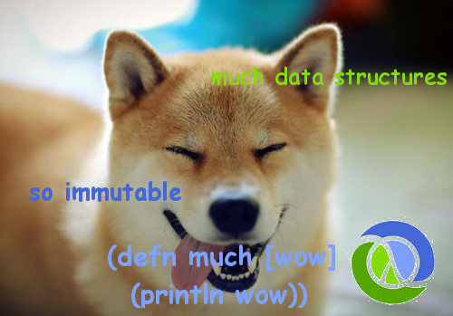

# Dogeon



[DSON](dogeon.org) is a JSON like data interchange format for doges,
because doges deserve their own dataformat not hampered by the
insanities of JavaScript and other petty languages. Written with beer
for hilarity's sake and the glory of doge.

## Usage

```clojure
user> (require '[me.arrdem.dogeon :refer [read-dogeon]])
nil
user> (read-dogeon "such \"foo\" is \"bar\" , \"doge\" is \"shibe\" wow")
{"foo" "bar", "doge" "shibe"}

```

## License

Copyright © 2014 Reid "arrdem" Dogelas McKenzie

Distributed under the Eclipse Public License either version 1.0 or (at
your option) any later version.
